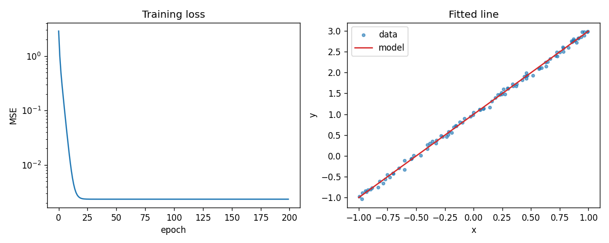
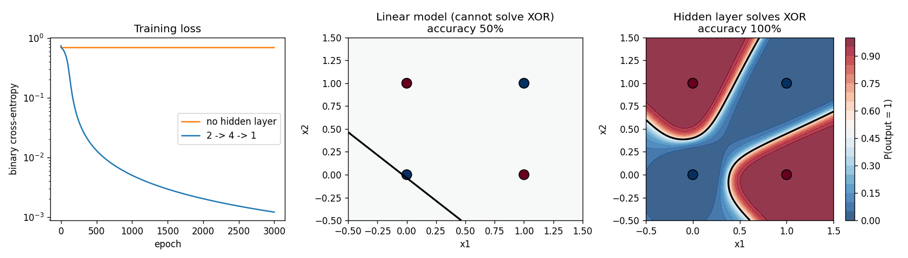
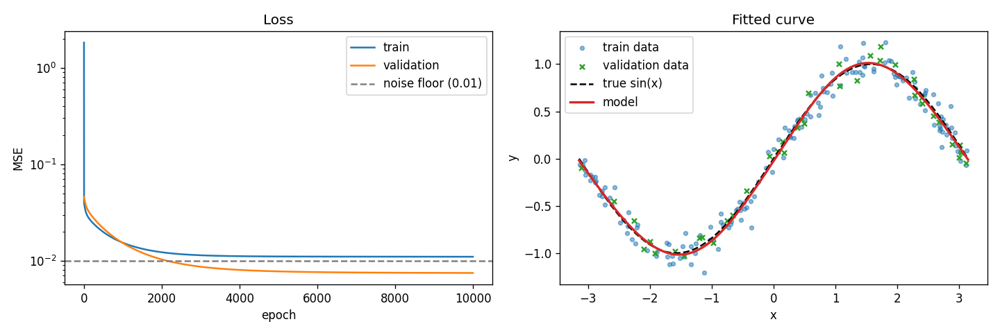
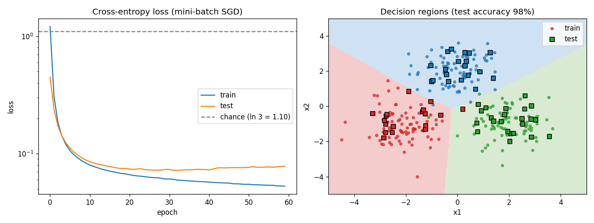

# Neural Network From Scratch

A minimal deep learning library built with **only NumPy** — no PyTorch, no TensorFlow, no autograd.
The goal is to understand (and demonstrate) every step of how a neural network learns: the forward pass, backpropagation, and optimization.

> **Status:** 🚧 In progress — Day 8 of 14 (MNIST baseline). See the [roadmap](roadmap.md).

## Why this project?

Frameworks hide the math. Here every gradient is derived by hand, implemented manually, and verified with numerical gradient checking.

## Planned features

- Fully connected layers (`Dense`) with manual backpropagation
- Activations: ReLU, Sigmoid, Tanh, Softmax (stable, with fused cross-entropy gradient)
- Losses: MSE, Binary / Categorical Cross-Entropy
- Mini-batch training with shuffling (`fit(..., batch_size=32)`)
- Optimizers: SGD, Momentum, RMSProp, Adam
- Regularization: L2, Dropout
- Numerical gradient checking (`nn.gradcheck`) + 351 unit tests
- Examples: XOR, sine regression, 3-class blobs, MNIST

## Getting started

```bash
git clone https://github.com/AhdyAhmed/Neural-Network-From-Scratch.git
cd Neural-Network-From-Scratch

python -m venv .venv
source .venv/bin/activate        # Windows: .venv\Scripts\activate
pip install -r requirements.txt

pytest                           # should pass
python examples/day1_hand_example.py
python examples/day2_forward_pass.py
python examples/day3_backprop.py
python examples/day4_linear_regression.py
python examples/day5_gradient_check.py
python examples/xor.py
python examples/regression.py
python examples/three_class_blobs.py
python examples/mnist.py          # downloads MNIST (~17 MB) on first run
```

## Quick example

```python
import numpy as np
from nn.layers import Dense
from nn.losses import MSE
from nn.model import Sequential
from nn.optimizers import SGD

x = np.random.default_rng(0).uniform(-1, 1, size=(100, 1))
y = 2 * x + 1

model = Sequential([Dense(1, 1, seed=0)])
model.compile(loss=MSE(), optimizer=SGD(lr=0.3))
model.fit(x, y, epochs=200, verbose=0)

print(model.layers[0].W, model.layers[0].b)   # ≈ [[2.]] [[1.]]
```



## Demos

**XOR** — impossible for a linear model, solved by a 2 → 4 → 1 network:



**Noisy sine regression** — a 1 → 16 → 16 → 1 tanh network learns the curve from noisy samples:



**Three-class classification** — softmax + cross-entropy with mini-batch SGD:



## Project structure

```
nn/          Library code (layers, activations, losses, optimizers, model, gradcheck)
tests/       Unit tests and gradient checks
examples/    Runnable demos
notes/       Math derivations and study notes
notebooks/   Walkthrough notebooks
design.md    Architecture and design decisions
roadmap.md   Day-by-day plan
```

## Documentation

- [Design document](design.md)
- [14-day roadmap](roadmap.md)
- [Day 1 — math refresher and hand-worked example](notes/day1_math_refresher.md)
- [Day 2 — forward pass: Dense layer and activations](notes/day2_forward_pass.md)
- [Day 3 — backpropagation derivations](notes/backprop.md)
- [Day 4 — Sequential model, SGD, and the training loop](notes/day4_training_loop.md)
- [Day 5 — gradient checking and testing](notes/day5_gradient_checking.md)
- [Day 6 — XOR and sine regression](notes/day6_xor_and_regression.md)
- [Day 7 — Softmax, cross-entropy, and mini-batches](notes/day7_softmax_and_minibatches.md)
- [Day 8 — MNIST baseline](notes/day8_mnist.md)

## Results

| Experiment | Model | Training | Result |
|---|---|---|---|
| MNIST baseline (Day 8) | 784 → 128 → 64 → 10, ReLU, softmax | SGD lr 0.1, batch 64, 15 epochs | **97.62% test accuracy** (99.6% train, 97.6% validation) |


Raw numbers: [`results/day8_mnist_baseline.json`](results/day8_mnist_baseline.json). The test set is used once, after all
choices were made on the validation split. Later days will improve on this baseline and add a proper comparison (Day 13).

## License

MIT — see [LICENSE](LICENSE).
