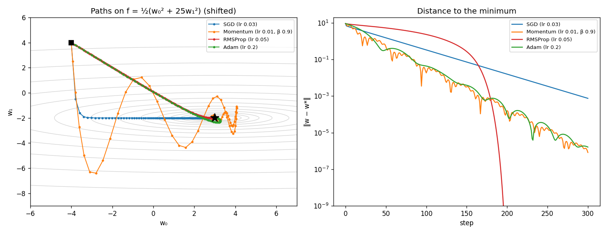
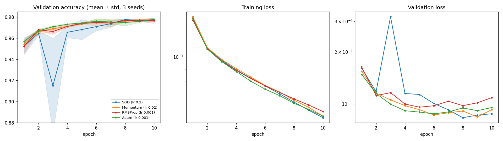

# Day 10 — RMSProp & Adam

**Goal:** add the adaptive optimizers and compare all four on the same problem.

```bash
python examples/optimizer_comparison.py --part 1    # instant: paths on an ill-conditioned quadratic
python examples/optimizer_comparison.py --sweep     # validation-only lr sweep for RMSProp and Adam (~2 min)
python examples/optimizer_comparison.py --part 2    # MNIST, 4 optimizers x 3 seeds x 10 epochs (~5 min, resumable)
```

## The update rules

| Optimizer | State per parameter | Update |
|---|---|---|
| SGD | none | `θ ← θ − η·g` |
| Momentum | velocity `v` | `v ← βv + g;  θ ← θ − η·v` |
| RMSProp | squared-gradient average `s` | `s ← ρs + (1−ρ)g²;  θ ← θ − η·g / (√s + ε)` |
| Adam | `m` and `v` | `m ← β₁m + (1−β₁)g;  v ← β₂v + (1−β₂)g²;  θ ← θ − η·m̂ / (√v̂ + ε)` with `m̂ = m/(1−β₁ᵗ)`, `v̂ = v/(1−β₂ᵗ)` |

**RMSProp** divides each parameter's step by the recent size of its own gradient, so a parameter with huge gradients and one with tiny gradients both move at about `η` per step. **Adam** is momentum plus that scaling, with bias correction.

All stateful optimizers share a small base class: state is kept by parameter position and created on the first step; using the optimizer with a different parameter list raises an error instead of silently mixing statistics, and `reset()` starts over. `Momentum` was moved onto this base; its Day 9 tests still pass unchanged.

### Bias correction: it makes the first step too *big* without it

`m` and `v` start at 0. After one step `m = 0.1·g` and `v = 0.001·g²` (with the default β's), so the raw ratio is `0.1 g / √(0.001 g²) = 3.16`. The two averages are biased by *different* amounts (10% vs 0.1%), and `v` is the more biased, so the uncorrected first step is about **3.2× too large**, not too small as I first assumed. Dividing by `1 − βᵗ` removes the bias exactly: the first Adam step is `η·sign(g)` for any gradient size (tested for 0.5, −0.5, 123 and 0.001). The correction fades as `t` grows.

RMSProp has no correction, so its first step is `η/√(1−ρ) ≈ 3.16·η` (tested). That is a known quirk, not a bug.

### Properties verified by tests

- **Scale invariance:** multiplying every gradient by 1000 leaves Adam's and RMSProp's trajectories unchanged (to 1e-6, thanks to ε), while SGD's changes completely.
- **Equalising coordinates:** with gradients `[0.001, 10]`, SGD moves the second coordinate 10,000× further; Adam and RMSProp move both by the same amount.
- **Badly scaled problems:** on a quadratic with curvatures 1 and 10,000, SGD's step is capped by the steep direction (lr < 2/10,000) and crawls, while Adam and RMSProp end up more than 100× closer to the minimum after 500 steps.
- Hand-calculated two-step sequences, in-place updates, zero gradients produce no NaN, step counter, `reset`, parameter-mismatch error, validation of every hyperparameter.

## Part 1: an ill-conditioned quadratic

`f = ½(x² + 25y²)`, 300 steps, one hand-picked learning rate per optimizer (not tuned fairly: this is an illustration, not a benchmark).



| Optimizer | Distance after 300 steps | Steps to get within 1e-3 |
|---|---|---|
| SGD (lr 0.03) | 7.5e-4 | 291 |
| Momentum (lr 0.01, β 0.9) | 8.3e-7 | 161 |
| RMSProp (lr 0.05) | 0 (to machine precision) | 179 |
| Adam (lr 0.2) | 1.6e-6 | 168 |

All four converge (the roadmap's check; the test runs 1000 steps and requires distance < 1e-6 for each). The paths show the difference in character. SGD races down the steep direction first, then crawls along the shallow one. RMSProp and Adam normalise each coordinate, so they head straight toward the minimum in a diagonal line. Momentum overshoots and spirals in.

## Part 2: MNIST

Same network as Days 8 and 9 (`784 → 128 → 64 → 10`, ReLU, He init, batch 64, 10 epochs, 3 seeds). Each optimizer uses its best learning rate from a validation-only sweep (seed 0, score = mean validation accuracy over the last 3 epochs).

### The sweep

| Optimizer | Learning rates tried → best |
|---|---|
| SGD, Momentum | from Day 9: SGD 0.2, Momentum 0.02 (same effective step) |
| RMSProp | 1e-4: 96.27, 3e-4: 97.62, **1e-3: 97.85**, 3e-3: 97.55 |
| Adam | 3e-4: 97.55, **1e-3: 97.60**, 3e-3: 97.37, 1e-2: 96.72 |

Both adaptive optimizers were best at their **default** `lr = 0.001`, with a usable range of roughly 3e-4 to 3e-3. SGD needed a sweep, and its winner sits right at the edge of stability (see below). Because the sweep used seed 0, which is also one of the three evaluated seeds, every optimizer's result is very slightly optimistic, equally.

### Results (validation accuracy, mean ± std over 3 seeds)



| Optimizer | Epoch 1 | Epoch 3 | Epoch 5 | Epoch 10 | Epochs to 97% | Seconds / epoch |
|---|---|---|---|---|---|---|
| SGD (lr 0.2) | 95.24 ± 0.80 | **91.51 ± 4.49** | 96.81 ± 0.95 | 97.74 ± 0.17 | 6, 5, 4 | 1.4 |
| Momentum (lr 0.02) | 95.44 ± 0.21 | 96.88 ± 0.25 | 97.34 ± 0.05 | 97.73 ± 0.05 | 4, 5, 3 | 1.5 |
| RMSProp (lr 0.001) | 95.22 ± 0.69 | 96.63 ± 0.27 | 97.39 ± 0.02 | 97.65 ± 0.25 | 4, 4, 4 | 2.3 |
| Adam (lr 0.001) | **95.69 ± 0.11** | **97.08 ± 0.12** | 97.43 ± 0.03 | **97.77 ± 0.04** | **4, 3, 3** | 2.5 |

### What this shows, and what it doesn't

- **Final accuracy is a tie.** All four end between 97.65% and 97.77%, a spread of 0.12 points, smaller than the seed-to-seed noise. With each optimizer at a tuned learning rate, I can't pick a winner on the final number, and I won't claim one.
- **The real difference is early speed and reliability.** Adam is at 97.1% after three epochs and reaches 97% in 3 to 4 epochs. SGD needs 4 to 6, and its tuned learning rate makes epoch 3 collapse to 91.5% ± 4.5 (per seed: 85.6, 96.5 and 92.4). Momentum and RMSProp sit in between. Adam's seed-to-seed spread stays between 0.03 and 0.31 points at every epoch and never shows a collapse like SGD's; RMSProp and Momentum are similar, so the stability gain comes mostly from the smoothing/normalisation, not from Adam specifically.
- **Adaptive methods needed less tuning.** Both worked best at the library default, 1e-3. SGD's best learning rate is a narrow ridge: a bit higher and it diverges, a bit lower and it is slower.
- **Adaptive methods reach their best validation loss sooner and then overfit.** Validation-loss minimum: RMSProp at epoch 5, Adam at epoch 6, Momentum at epoch 9, SGD at epoch 8. By epoch 10, validation loss is 9% (Adam) to 14% (RMSProp) above its minimum, against 5% for SGD, even though training losses are nearly identical (0.0175 to 0.0208). They fit the training set faster, which is a reason for the regularization on Day 11 and early stopping on Day 12.
- **Adaptive methods cost more per step.** About 1.6× the time per epoch here (these include a validation pass that is the same for all four, and the runs were timed at different moments, so treat the ratio as approximate). Adam also stores two extra arrays per parameter (`m` and `v`), so three times the parameter memory; trivial for 109k parameters, significant at scale.
- **Three seeds and one problem.** This is a single small network. The ranking could differ on other architectures or datasets.

## Along the way

- **I had the bias-correction direction backwards** until I did the arithmetic (see above): the uncorrected first step is too large. A test now documents the 3.16 factor.
- **The first quadratic demo ran for 150 steps and nothing got within 1e-3**, so the "steps to reach" column was all "not reached". I extended it to 300 steps rather than hand-tuning learning rates until it looked good.
- **The first comparison plot clipped SGD's epoch-3 dip** (y-axis started at 0.93, the mean was 0.915). I widened the axis so the instability is visible.
- **The `--budget` option** that makes long runs resumable (added on Day 9) was needed again: each configuration is cached, and re-running the command continues where it stopped.

## Tests (492 total, 48 new)

- 40 in `tests/test_adaptive_optimizers.py` (the properties above, plus convergence of all four optimizers on the quadratic, end-to-end training of a linear model with each adaptive optimizer, and Adam solving XOR on 5 seeds).
- 6 on the example (every optimizer converges in the demo, momentum and the adaptive methods beat SGD in steps-to-reach, the tuned table is consistent with the Day 9 effective-step logic).
- 2 on the saved results JSON, pinning the claims in this file: final accuracies within 0.5 points, Adam above 97% at epoch 3 while SGD is below 95%, and SGD's epoch-3 spread more than 10× Adam's.

## Self-check questions

- Why is Adam's first step exactly `η·sign(g)`? *(After bias correction `m̂ = g` and `v̂ = g²`, so the ratio is `g/|g|`.)*
- Why do RMSProp and Adam ignore a global rescaling of the loss? *(The gradient appears in both the numerator and the root of the denominator.)*
- If all four end at the same accuracy, why prefer Adam? *(Faster, steadier early training and little learning-rate tuning; the price is more compute and memory per step.)*
