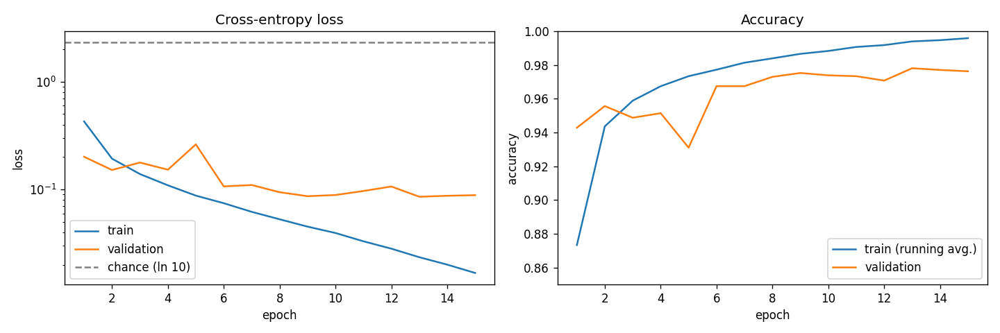

# Day 8 — MNIST Classification (Baseline)

**Goal:** train on real data and save baseline numbers that later days (momentum, Adam, dropout) must beat.

```bash
python examples/mnist.py     # downloads ~17 MB the first time, ~15 s to train
```



Everything below comes from `results/day8_mnist_baseline.json`, which the script writes (a test checks the file stays consistent).

## Setup

| | |
|---|---|
| Data | MNIST: 50,000 train / 10,000 validation / 10,000 test, pixels scaled to [0, 1], 784 features |
| Model | `784 → 128 → 64 → 10`, ReLU, ReLU, Softmax: **109,386 parameters** |
| Loss | Categorical cross-entropy (fused softmax gradient from Day 7) |
| Optimizer | SGD, learning rate 0.1, batch size 64, 15 epochs |
| Init | Normal, std 0.1 (temporary; He init arrives on Day 9) |
| Speed | about 1 s per epoch, 15 s total (pure NumPy) |

## Baseline result

| Metric | Value |
|---|---|
| Train accuracy (running average, last epoch) | 99.58% |
| Validation accuracy (last epoch) | 97.62% |
| **Test accuracy** | **97.62%** |
| Test loss | 0.0848 |
| Chance level | 10% (loss `ln 10 = 2.303`) |

### How to read these numbers honestly

- **The test set was used exactly once**, after training. Every choice (learning rate, init scale) was made on the validation split.
- **Validation and test accuracy are both exactly 97.62%** (9,762 of 10,000). That is a coincidence: the losses differ (0.0886 vs 0.0848), so they are separate computations on separate data.
- **The validation curve is noisy.** Over the last five epochs it ranges from 97.07% to 97.80%, and epoch 5 dipped to 93.1% (loss spiked to 0.262) before recovering. Constant-learning-rate SGD with batch size 64 jitters. Reading the final epoch as "the" accuracy is fine, but differences under about 0.5% between configurations are within this noise.
- **Train accuracy is a running average** over the epoch's batches (computed from predictions made *while* the weights were changing), like Keras. It is not the accuracy of the final weights on the training set.
- **There is a gap:** 99.6% train vs 97.6% validation, and validation loss stops improving around epoch 9 to 13 while train loss keeps falling. That is the start of overfitting. Dropout and L2 (Day 11) and early stopping (Day 12) are aimed at this.

## The sweep (validation set only)

Ten epochs, batch size 64:

| Init std | LR | Final val. accuracy | Lowest val. accuracy in last 5 epochs |
|---|---|---|---|
| **0.1** | **0.1** | **97.38%** | 96.74% |
| 0.1 | 0.05 | 97.20% | 95.88% |
| 0.05 | 0.05 | 97.31% | 96.02% |
| 0.01 | 0.05 | 96.81% | 94.13% |

The first three are statistically indistinguishable given the noise above; I picked the first. The smallest init (std 0.01, the library default) is clearly worse and the least stable. In a quicker 3-epoch test, std 0.01 reached only 87.3% validation accuracy where std 0.1 reached 94.9%. That is a preview of Day 9: initialization scale matters a lot, and a principled rule (He/Xavier) beats trial and error.

Also seen: `lr = 0.2` was fast early (96.2% after two epochs) but collapsed to 85% in epoch 3. A bigger step is not always better.

## What's new in the library

### `nn/datasets.py`: `load_mnist()`

Returns `((x_train, y_train), (x_val, y_val), (x_test, y_test))` with `float32` images `(N, 784)` and `int64` labels `(N,)`, caching the file in `data/` (git-ignored).

- **Source:** the `mnist.pkl.gz` file in Michael Nielsen's `neural-networks-and-deep-learning` GitHub repo (the book already in `design.md`'s references), with a fallback URL. It already contains the standard 50k/10k/10k split.
- **Integrity:** the download is checked against a pinned SHA-256 before use; a corrupt or tampered file is deleted and rejected.
- **Safe parsing:** the file is a Python pickle, and unpickling untrusted data can run code. The loader uses a **restricted unpickler** that only allows the three NumPy classes the file needs. A test feeds it a malicious pickle that would create a file and confirms it is refused and never executed.
- **Offline:** `load_mnist(download=False)` raises `FileNotFoundError` instead of fetching; the error message says where to place the file by hand.
- **What I could and couldn't verify:** the GitHub URL is the only one reachable from my sandbox, so it is the only one I tested against the real data. I deliberately did not add the usual Google/Amazon mirrors, because I couldn't check them.

### `nn/metrics.py`: `accuracy(y_pred, y_true)`

Multi-class (one-hot or integer labels) and binary (threshold 0.5, strictly greater).

### `fit(..., metrics={"accuracy": accuracy})`

Adds `history["accuracy"]` and `history["val_accuracy"]` per epoch and prints them. Validation now needs one forward pass for both loss and metrics (not one each).

## Tests (351 total, 38 new)

- **Metric:** all label layouts, thresholds, shape errors.
- **fit metrics:** keys and lengths, batch-size-weighted running metric (with a ~zero learning rate it must equal the full-data accuracy for any uneven batching), validation values match a manual computation.
- **Loader (synthetic files, no network):** parsing and round-trip, layout and shape validation, the malicious-pickle test, checksum rejection, download success path, rejection of corrupt downloads without leaving files behind, and falling back to the second mirror.
- **Real data (skipped if MNIST isn't cached):** split sizes, pixel range, balanced classes, no train/test duplicates, and a 2-epoch run far above chance.
- **Committed results:** the saved JSON has 15 epochs, a consistent final validation number, test accuracy above 97%.

### Two small test mistakes

My first synthetic test files failed to load. They used pickle protocol 2, which writes NumPy arrays through `_codecs.encode`, and the strict loader (correctly) refuses that. I changed the test files to protocol 4 rather than loosening the security check. A threshold of "above 85%" for a 2-epoch smoke test also failed at 84.75%, so I relaxed it to 70% (chance is 10%).

## Self-check questions

- Why must the test set stay untouched until the end? *(Choosing hyperparameters by looking at it makes the final number optimistic.)*
- Why is the running train accuracy lower than the accuracy you would measure on the training set after the epoch? *(Early batches were predicted with older, worse weights.)*
- Why can a pickle file be dangerous, and what two defenses does the loader use? *(It can execute arbitrary code when loaded; a pinned checksum and a restricted unpickler.)*
