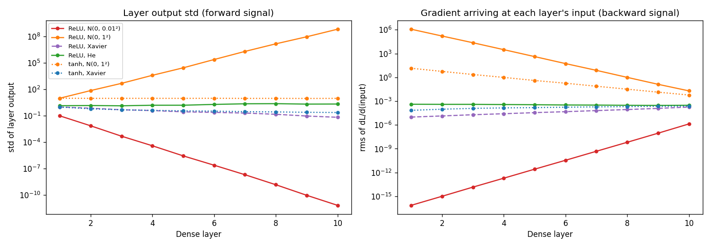
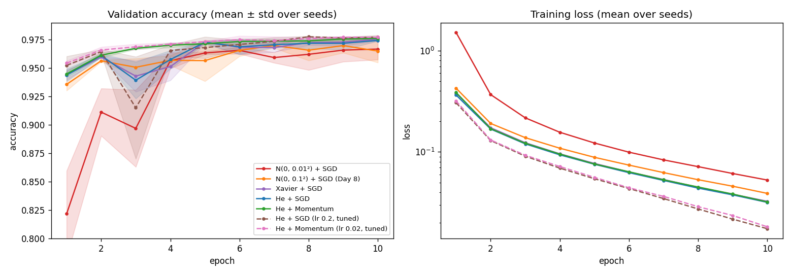

# Day 9 — Weight Initialization & Momentum

**Goal:** train faster and more stably.

```bash
python examples/init_comparison.py --part 1    # instant: signal size vs depth (no download)
python examples/init_comparison.py --part 2    # MNIST comparison, ~4 min (resumable with --budget)
python examples/init_comparison.py --sweep     # the validation-only learning-rate sweep
```

New in the library: `nn/initializers.py`, the `Momentum` optimizer, `nn/diagnostics.py`, and `Dense(..., initializer="he")`.

---

## 1. Why initialization matters

Each `Dense` layer multiplies its input by `W`. Stack ten of them and the signal is multiplied by roughly `gain¹⁰`. A gain of 0.1 per layer leaves 1e-10; a gain of 10 gives 1e10. The same happens to the gradient on the way back. Good initialization sets the gain to about 1.

| Scheme | Weight variance | Use before |
|---|---|---|
| Xavier / Glorot | `2 / (fan_in + fan_out)` | tanh, sigmoid, softmax |
| He | `2 / fan_in` | ReLU |

**Why He differs from Xavier:** ReLU zeroes about half its inputs, which halves the second moment of the signal at every layer. He's extra factor of 2 in the variance cancels that loss. Xavier assumes the activation roughly preserves variance, which is why it suits tanh near zero.

`initializer_for(activation)` encodes the rule (ReLU → He, otherwise Xavier). In the MNIST network that means He for the two layers feeding ReLU and Xavier for the output layer feeding softmax.

### What the signal does through depth

A 10-hidden-layer, width-100 network on random data (`assets/day9_signal_through_depth.png`):



| Network | Output std, layer 1 → layer 10 | Gradient at layer 1 vs layer 10 |
|---|---|---|
| ReLU, N(0, 0.01²) | 1e-1 → **7e-12** | **5.5e-11×** (vanishes) |
| ReLU, N(0, 1²) | 1e1 → **7e8** | **5.9e7×** (explodes) |
| ReLU, Xavier | 1.0 → 0.068 | 0.054× (shrinks about 2× per layer) |
| ReLU, **He** | 1.4 → 2.2 | **1.3×** (flat) |
| tanh, N(0, 1²) | 9.9 → 9.6 (flat!) | 2400× (explodes) |
| tanh, **Xavier** | 1.0 → 0.24 | 0.29× |

Two lessons beyond the headline:

1. **ReLU + Xavier shrinks by about 2× per layer**, exactly as the theory says, so He is not just a different label.
2. **A flat activation scale is not the same as healthy.** Tanh with std-1 weights keeps a constant output std only because 79% of units are pinned at ±1. The gradient still explodes by 2400×. That is why the diagnostics look at gradients and saturation as well as activation size.

---

## 2. Momentum

```
v ← β·v + g
θ ← θ − η·v
```

`v` is a running sum of past gradients. Where the gradient keeps pointing the same way, `v` builds up to `1/(1−β)` times it (10× for β = 0.9). Where it flips sign each step (the steep walls of a narrow valley), the contributions cancel.

- `β = 0` is exactly plain SGD (tested).
- On the 2D valley `f = ½(w₀² + 100w₁²)`, after the same 150 steps momentum is under 5% as far from the minimum as SGD is (tested).
- **Effective step size:** momentum's steady-state step is `η/(1−β)`, so `Momentum(lr=0.01, β=0.9)` takes the same long-run step as `SGD(lr=0.1)`. The comparison below uses that equivalence so it measures the *effect of momentum*, not of a bigger learning rate.

---

## 3. Diagnostics: spotting vanishing and exploding signals

```python
from nn.diagnostics import collect_statistics, format_statistics, diagnose
stats = collect_statistics(model, x_batch, y_batch)   # one forward + backward pass, no updates
print(format_statistics(stats))
for w in diagnose(stats): print("WARNING:", w)
```

Per layer: output mean/std/max, % of exact zeros, % saturated (tanh/sigmoid), % of dead ReLU units, the gradient reaching the layer's input, weight rms, weight-gradient rms, and the **update ratio dW/W**. `diagnose` turns these into warnings (vanishing/exploding signal, vanishing/exploding gradients, negligible/huge updates, dead ReLU units, saturation, NaN/inf). Thresholds are deliberately loose and documented at the top of the module.

On the real network, before any training (512 MNIST images):

```
He init
 # layer             out std  %zero | grad-in rms  weight rms     dW rms      dW/W
 0 Dense(784 -> 128) 4.49e-01    0% |   8.288e-05   5.051e-02  2.915e-03  5.77e-02
 1 ReLU()            2.64e-01   52% |   1.454e-04
 2 Dense(128 -> 64)  4.32e-01    0% |   2.106e-04   1.245e-01  4.164e-03  3.34e-02
 4 Dense(64 -> 10)   3.45e-01    0% |   3.133e-04   1.654e-01  9.800e-03  5.92e-02
 -> no warnings
```

With `N(0, 0.01²)` the same network shows output std of 3e-4 at the last layer and a gradient at the first layer about 1000× smaller (7.9e-8 vs 8.3e-5). `diagnose` flags the tiny output, but **not** the gradients: with only three layers the damage is mild, below the 1e-3 first/last ratio threshold. The dramatic failures need depth, as in the table above.

The diagnostics also caught a classic that I did not plan for: a 8-hidden-layer **sigmoid** network is flagged for vanishing gradients *even with Xavier init*, because the sigmoid derivative is at most 0.25. Initialization cannot fix that; it is a reason ReLU replaced sigmoid in deep networks.

To support this, `Sequential.forward` and `backward` take an optional `record=` list. It changes nothing when omitted (tested: recorded and unrecorded runs give identical gradients).

---

## 4. MNIST: initialization and momentum compared

Same `784 → 128 → 64 → 10` ReLU network, batch size 64, 10 epochs, **3 seeds** per row, validation accuracy (mean ± std over seeds). The test set is not touched today (Day 13 does the final comparison).



| Configuration | Epoch 1 | Epoch 3 | Epoch 5 | Epoch 10 | Epochs to 97% (3 seeds) |
|---|---|---|---|---|---|
| N(0, 0.01²) + SGD (old library default) | 82.2 ± 3.8 | 89.7 ± 3.4 | 96.3 ± 0.1 | 96.7 ± 0.9 | 8, 9, 8 |
| N(0, 0.1²) + SGD (**Day 8 baseline**) | 93.6 ± 0.6 | 95.1 ± 0.8 | 95.7 ± 1.8 | 96.5 ± 1.0 | 8, 7, 6 |
| Xavier + SGD | 94.4 ± 0.5 | 94.3 ± 1.4 | 97.3 ± 0.1 | 97.5 ± 0.1 | 5, 5, 5 |
| He + SGD | 94.4 ± 0.6 | 93.9 ± 1.6 | 97.3 ± 0.1 | 97.4 ± 0.1 | 5, 5, 5 |
| **He + Momentum** (lr 0.01, same effective step) | 94.5 ± 0.3 | **96.8 ± 0.1** | 97.2 ± 0.0 | **97.6 ± 0.1** | **4, 5, 4** |
| He + SGD (lr 0.2, tuned) | 95.2 ± 0.8 | 91.5 ± 4.5 | 96.8 ± 1.0 | 97.7 ± 0.2 | 6, 5, 4 |
| He + Momentum (lr 0.02, tuned) | 95.4 ± 0.2 | 96.9 ± 0.3 | 97.3 ± 0.1 | 97.7 ± 0.1 | 4, 5, 3 |

(The last two rows use the best learning rates from a validation-only sweep with seed 0; both have the same effective step of 0.2. The sweep is in the table in section 5.)

### What this shows, and what it doesn't

- **He + Momentum is clearly faster and steadier than the Day 8 setup.** It reaches 97% validation accuracy in 4 to 5 epochs instead of 6 to 8, is higher at every epoch from 3 on, and ends at 97.6% instead of 96.5%. The Day 8 result of 97.6% (15 epochs, seed 0) was a favourable seed: averaged over three seeds at 10 epochs, that setup scores 96.5 ± 1.0.
- **Initialization is the bigger factor.** The old default (std 0.01) starts at 82% after one epoch; Day 8's std 0.1 at 93.6%; He/Xavier at 94.4%. For this shallow network, though, the effect is moderate. The dramatic failures in section 1 need depth.
- **He and Xavier are indistinguishable here** (97.4% vs 97.5%, within the seed noise). The theory favours He for ReLU, and section 1 shows it clearly at depth 10, but this network has only two hidden layers, so the factor of 2 per layer barely compounds. I won't claim an advantage the data doesn't show.
- **Momentum's main benefit is stability, not the final number.** At the same effective step, SGD and momentum end within noise of each other (97.4 vs 97.6). But at epoch 3, SGD drops to 93.9 ± 1.6 while momentum climbs steadily to 96.8 ± 0.1. With the larger step (0.2), SGD collapses to 91.5 ± 4.5 at epoch 3 and momentum does not (96.9 ± 0.3). Averaging gradients over steps smooths the jitter that makes plain SGD at a high learning rate unreliable.
- **Seed-to-seed spread matters.** Many gaps in the middle columns are smaller than one standard deviation; only 3 seeds, so treat 0.2 to 0.3 point differences as noise.

## 5. The learning-rate sweep (validation only, seed 0)

Score = mean validation accuracy over the last 3 of 10 epochs.

| Optimizer | lr | Score | Epoch 3 |
|---|---|---|---|
| He + SGD | 0.05 | 97.46 | 94.35 |
| He + SGD | 0.1 | 97.55 | 93.41 |
| He + SGD | **0.2** | **97.75** | 85.63 |
| He + Momentum | 0.005 | 97.40 | 95.98 |
| He + Momentum | 0.01 | 97.61 | 96.69 |
| He + Momentum | **0.02** | **97.75** | 96.67 |
| He + Momentum | 0.05 | 97.56 | 96.97 |

Both winners tie at 97.75%, and both have effective step 0.2. SGD's winner dips to 85.6% in epoch 3 on the way, momentum's does not.

## Mistakes and surprises along the way

- **My first diagnostic for "vanishing gradients" did not fire.** I compared first-layer and last-layer *weight* gradients, but those stayed similar (they are products of a shrinking activation and a growing backward signal) even though learning was impossible. The reliable signals were the gradient reaching each layer's *input* and the update ratio dW/W (about 1e-12 in the vanishing case). I switched the checks to those.
- **A background job was killed between tool calls.** The first attempt to run the 3-seed MNIST comparison in the background died with only one configuration done. I made `run_comparison` resumable (each finished configuration is cached under `data/`), so the run can be restarted with the same command.
- **Backward compatibility held exactly.** I refactored `Dense` initialization, then re-ran Day 8: the saved history is identical number for number.

## Tests (444 total, 93 new)

- **Initializers:** variance of He and Xavier (normal and uniform) to within 2%, uniform bounds, reproducibility, invalid sizes, name registry and error messages, recommended initializer per activation, `Dense` integration (including "both `initializer` and `init_scale`" error and unchanged defaults), and the depth experiment (He keeps ReLU activations at 0.5 to 2× the input scale through 10 layers; Xavier shrinks them below 0.01×).
- **Momentum:** hand-computed first two steps, `β = 0` equals SGD, in-place updates, steady-state step `lr·g/(1−β)`, convergence, beats SGD in a narrow valley, `reset`, parameter-set mismatch error, validation of `lr` and `β`.
- **Diagnostics:** recording hooks, statistics against manual NumPy calculations, no parameter changes, healthy networks give no warnings, and each pathology (vanishing, exploding, deep sigmoid, saturated tanh, dead ReLU, NaN) is diagnosed.
- **Saved results:** the committed JSON must still support the claims in these notes.

## Self-check questions

- Why does He have a factor of 2 that Xavier lacks? *(ReLU zeroes about half the signal, halving the variance each layer.)*
- Why can plain SGD at a large learning rate dip while momentum at the same effective step does not? *(Momentum averages noisy gradients, so one bad step is damped by the others.)*
- Why is a constant activation scale not proof of a healthy network? *(Saturated tanh units give a constant output while the gradient through them explodes or vanishes.)*
